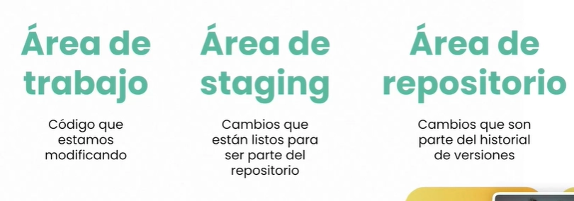
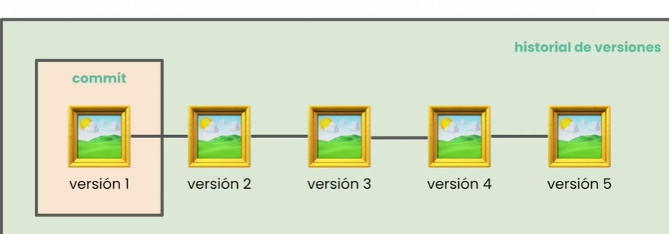
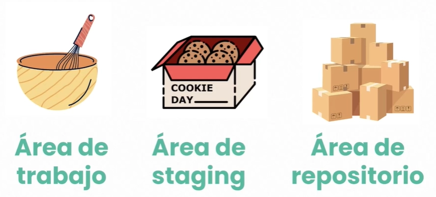
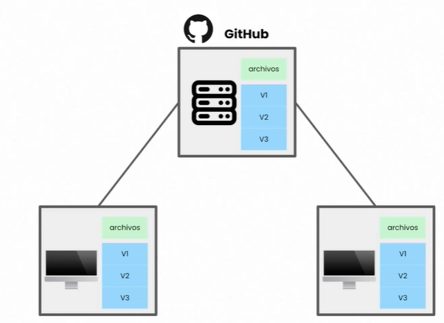

# Control de versiones

> El control de versiones es el seguimiento ordenado de **todos los cambios** realizados en un proyecto a lo largo del tiempo, permitiendo recuperar cualquier estado anterior.

---

## Tipos de control de versiones

| Tipo | Cómo funciona | Ventaja | Limitación |
|------|--------------|---------|------------|
| **Local** | El historial se almacena únicamente en tu PC | Simple, sin configuración | Si falla el equipo, se pierde todo |
| **Centralizado** (CVCS) | Un servidor único guarda el historial; los clientes solo descargan la última versión | Control central, fácil de administrar | Sin conexión al servidor no puedes trabajar; punto único de fallo |
| **Distribuido** (DVCS) | Cada cliente clona el repositorio completo, incluyendo todo el historial | Sin conexión funciona igual; múltiples copias = más seguro | Curva de aprendizaje mayor |

---

## Git

> Las herramientas nacen a raíz para solucionar un problema. En 2005, luego de que la comunidad de Linux rompiera lazos con BitKeeper (el sistema propietario que utilizaban hasta entonces), Linus Torvalds diseñó Git. El proyecto nació con el objetivo de ofrecer una alternativa de control de versiones que fuera completamente libre, robusta y distribuida.

Principales características:
- Realiza **copias de seguridad** del proyecto en cada clon
- Facilita el **trabajo en equipo** con ramas y merges
- Permite **recuperar cualquier versión anterior** del proyecto
- Es extremadamente **rápido** porque la mayoría de operaciones son locales
- Cada cambio se identifica con un **hash SHA-1**: una cadena alfanumérica de 40 caracteres generada a partir del contenido. Esto garantiza la integridad — si algo cambia, el hash cambia.

```
Ejemplo de hash SHA-1:
a3f5c21b8e4d9071f2cc3a0b56781234abcd5678
  ```

---

## Tipos de repositorio

> Un **repositorio** es una carpeta que, además de los archivos del proyecto, contiene una subcarpeta oculta `.git` donde Git almacena todo el historial de cambios. Eso se crea con `git init`.

La diferencia entre un **directorio normal** y un **repositorio Git** es precisamente esa carpeta `.git`.

| Tipo | Dónde vive | Características |
|------|-----------|----------------|
| **Local** | Tu ordenador | Solo tú tienes acceso; es donde trabajas día a día |
| **Remoto** | La nube (GitHub, GitLab, Bitbucket…) | Compartido con el equipo; actúa como fuente de verdad |

---

## Áreas de trabajo en Git

Git divide el flujo de trabajo en **tres zonas** principales:




```
┌─────────────────┐     git add      ┌──────────────┐    git commit    ┌───────────────────┐
│  Working        │ ──────────────▶  │   Staging    │ ──────────────▶  │   Repository      │
│  Directory      │                  │   Area       │                  │   (.git)          │
│  (área de       │                  │  (índice /   │                  │   Historial de    │
│   trabajo)      │  ◀──────────────  │   caché)     │                  │   commits         │
└─────────────────┘   git checkout   └──────────────┘                  └───────────────────┘
```

| Zona | También llamada | Para qué sirve |
|------|----------------|----------------|
| **Working Directory** | Área de trabajo | Donde editas los archivos del proyecto |
| **Staging Area** | Índice / caché | Zona de preparación: acumulas cambios antes de confirmarlos |
| **Repository** | `.git` directory | Almacena los commits — "fotos" permanentes del proyecto |

El **área de repositorio** nos permite almacenar paquetes de cambios a modo de fotos de código cada uno de esas fotos se le conoce como commit.



### ¿Qué es un commit?

Un **commit** es una fotografía del estado del proyecto en un momento dado. Cada commit tiene:
- Un **hash SHA-1** único
- Un **mensaje** descriptivo
- El **autor** y la **fecha**
- Una referencia al commit anterior (formando una cadena)

### Analogía: preparar galletas 🍪



| Paso | Equivalente en Git |
|------|--------------------|
| Tener ingredientes en la mesa | Working Directory (archivos modificados) |
| Preparar y medir los ingredientes en un bowl | `git add` → Staging Area |
| Meter las galletas al horno y obtener el resultado final | `git commit` → guardar en el repositorio |
| Sacar las galletas y tenerlas listas | El commit queda en el historial permanentemente |

---

## Git vs GitHub



| | Git | GitHub |
|---|-----|--------|
| **¿Qué es?** | Sistema de control de versiones distribuido | Plataforma web para alojar repositorios Git |
| **¿Dónde corre?** | En tu computador (línea de comandos) | En la nube (interfaz web + API) |
| **¿Quién lo creó?** | Linus Torvalds (2005) | Tom Preston-Werner, Chris Wanstrath y otros (2008) |
| **¿Puede funcionar sin el otro?** | Sí — Git funciona 100% sin GitHub | No — GitHub necesita Git por debajo |
| **Función principal** | Gestionar el historial de cambios localmente | Colaborar, hacer code review, CI/CD, issues, wikis |

> **Analogía**: Git es el motor del coche; GitHub es la autopista y las gasolineras.

Otras plataformas similares a GitHub: **GitLab**, **Bitbucket**, **Azure DevOps**.

---

## Estados de un archivo en Git

Un archivo puede estar en uno de estos estados:

```
Untracked  ──── git add ────▶  Staged  ──── git commit ────▶  Committed
                                  │                                │
               git add ◀──── Modified  ◀──── (se edita) ─────────┘
```

| Estado | Significado |
|--------|-------------|
| **Untracked** | Git no hace seguimiento de este archivo todavía |
| **Modified** | El archivo fue editado pero los cambios no están preparados |
| **Staged** | Los cambios están en el staging area, listos para el commit |
| **Committed** | Los cambios están guardados de forma permanente en el repositorio |

---

## Comandos básicos

```bash
# Iniciar un repositorio
git init

# Ver el estado de los archivos
git status

# Añadir al staging area
git add <archivo>
git add .                   # todos los cambios

# Confirmar los cambios
git commit -m "mensaje descriptivo"

# Ver el historial de commits
git log
git log --oneline           # versión resumida

# Conectar con un repositorio remoto
git remote add origin <url>

# Subir cambios al remoto
git push origin main

# Descargar cambios del remoto
git pull origin main

# Clonar un repositorio
git clone <url>
```

---

## Flujo básico de trabajo

```
1. Modificar archivos en el Working Directory
        ↓
2. git add → mover cambios al Staging Area
        ↓
3. git commit → guardar "foto" en el repositorio local
        ↓
4. git push → subir commits al repositorio remoto (GitHub)
```
